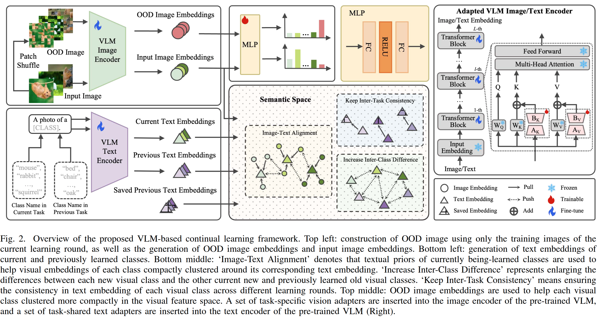
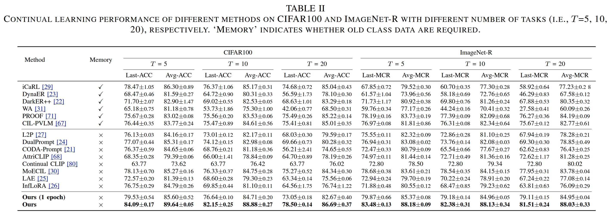

# Visual Class Incremental Learning with Textual Priors Guidance based on an Adapted Vision-Language Model
This is the official repository for Pytorch Implementation of "Visual Class Incremental Learning with Textual Priors Guidance based on an Adapted Vision-Language Model". 

## Framework



## Main results



## Installation
```bash
git clone https://github.com/Fatflower/CIL_Adapted_VLM.git
cd CIL_Adapted_VLM
pip install -r requirements.txt


```


## Data Preparation

Before running the project, make sure you have the necessary datasets ready. All input images are resized or cropped to **224 × 224** pixels.

##  Prepare Pretrained Models

1. Create a directory:
    ```bash
    mkdir -p pretrain_weights/clip_vit_base_patch16
    ```

2. Download the pretrained model from:  
   [https://huggingface.co/openai/clip-vit-base-patch16/tree/main](https://huggingface.co/openai/clip-vit-base-patch16/tree/main)

3. Place the downloaded files into the `pretrain_weights/clip_vit_base_patch16/` directory.

---


## Training

```bash
CUDA_VISIBLE_DEVICES=0 python main.py --config options/clip_two/imagenet_r.yaml

```
**Note:**  
 You can replace `imagenet_r.yaml` with any dataset-specific configuration file, such as:

 - `options/clip_two/cifar100.yaml`
 - `options/clip_two/skin40.yaml`
 - `options/clip_two/your_dataset.yaml`


## Test

```bash

CUDA_VISIBLE_DEVICES=0 python main_test.py --config options/clip_two/imagenet_r.yaml --test_dir logs/multi_step/clip_two_cil_replay_None/imagenetr_i2t/clip_vit_b_16_224_b20i20/seed_100

```

Make sure that:

- `--config` points to the correct dataset configuration.
- `--test_dir` points to the directory containing your trained model logs and checkpoints.


##  Citation

If you use this project in your research, please cite:
```bibtex
@article{zhang2025visual,
  title   = {Visual Class Incremental Learning with Textual Priors Guidance based on an Adapted Vision-Language Model},
  author  = {Zhang, Wentao and Yu, Tong and Wang, Ruixuan and Xie, Jianhui and Trucco, Emanuele and Zheng, Wei-Shi and Yang, Xiaobo},
  journal = {IEEE Transactions on Multimedia},
  year    = {2025},
  publisher = {IEEE}
}

```
---

You are also welcome to reference my other work:

**Title**: Continual Learning of Image Classes With Language Guidance From a Vision-Language Model

**Citation**:
```bibtex
@article{zhang2024continual,
  title   = {Continual Learning of Image Classes With Language Guidance From a Vision-Language Model},
  author  = {Zhang, Wentao and Huang, Yujun and Zhang, Weizhuo and Zhang, Tong and Lao, Qicheng and Yu, Yue and Zheng, Wei-Shi and Wang, Ruixuan},
  journal = {IEEE Transactions on Circuits and Systems for Video Technology},
  year    = {2024},
  publisher = {IEEE}
}

```

- **IEEE Link**: https://ieeexplore.ieee.org/abstract/document/10644076

- **GitHub Repo**: https://github.com/Fatflower/CIL_LG_VLM


---

##  Contact

For questions, suggestions, or collaborations, feel free to reach out:

-  GitHub Issues: [https://github.com/Fatflower/CIL_Adapted_VLM/issues](https://github.com/Fatflower/CIL_Adapted_VLM/issues)
-  Email: zhangwt65@mail2.sysu.edu.cn / z1282429194@163.com

We welcome contributions and feedback!

---
